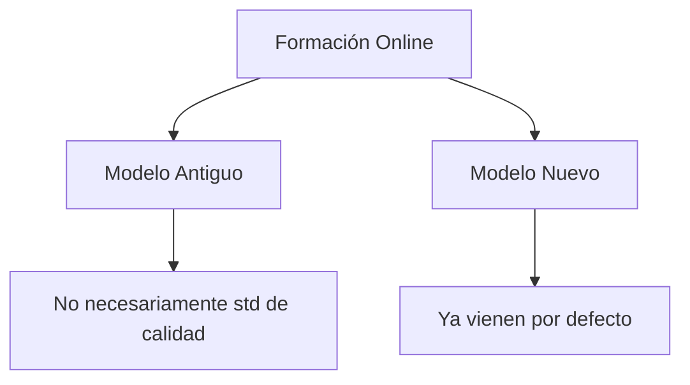

# Jornada mensual VRAC - Marzo
**📅 Fecha:** 31/03/2026

---

## 📌 Acuerdos Generales

- **Reuniones obligatorias** 1 vez al mes
  - → Instancia de coordinación e interacción entre todos de forma más directa
- **Pendientes:** Campus creativo y derecho
- **Priorización (hoy)** de temas
- ⚠️ **Golpe:** No acreditación de Magíster en Educación (expectativas eran acreditarse)
  - Mirar qué pase con todo lo relativo a online
  - Pausa para retomar y avanzar
- 🎯 **Rol más activo de nosotros en búsqueda de soluciones**

---

## 🎯 Objetivo de esta Reunión

- → Claridad en lo que haremos este año en función de prioridades
- → Avanzar con celeridad pero calma

---

## Prioridades

### ① Cumplimiento de Regulación Nacional

#### Acreditar Medicina
- Es clave la presentación a acreditación nacional

#### Educación (Pedagogías)
- Debe repuntar
- No podemos tener los mismos años

#### DAC's
- Involucrarse en todo; ser pro-activos y auto gestionarse
- Características esperadas:
  - → Autogestión
  - → Autorregulación
  - → Independencia
  - → Responsabilidad

⚠️ **OJO:** Esto es de ahora en adelante + respeto y pasada de asuntos

#### Odontología
- También está en prioridades

⚠️ **OJO:** Apoyo existe, pero debe ser con tiempo

---

### ② Formación Online

#### 2 Escenarios:

- → "Ordenar" diversidad de diseños/modelos que hoy existen
- → Aun si no se pueden cambiar por completo (versiones antiguas) deben acercarse a std mínimo de calidad

#### Validación de diseños instruccionales en aulas virtuales

🎯 **Meta:** Certificar con QM 30 diseños instruccionales
- ⚠️ Hay que chequear todo. No modificar nada al azar
- **Responsabilidad del DAC**

> **(QM: Quality Match)**

- → Esto es tarea prioritaria (pre-postgrado)
- → Verificar si están de acuerdo a prog. de estud. y cómo están funcionando

#### Paso 1: Claridad de decretos

- ⚠️ **OJO:** Si carrera está en acreditación debe estar completamente diseñado
- → En otros casos, debe haber un plan que justifique el porqué de cada diseño

#### Otro tema: Requisitos de admisión en postgrado online
- → Respeto de los procedimientos ya establecidos
- → No podemos tener admisión sin entrevistas, por ejemplo

🎯 **Objetivo "nuestro":** Tener 60 acreditaciones QM (no 30)

#### Salud - 5 carreras
- → Se estableció que solo 1 podía entrar
- → Criterios Art. Salud y online en 1 mes más

---

### ③ Internacionalización Académica y Reputación

#### AACSB
- Suspendido hasta 2027
- Está aceptado por directivos superiores

#### ABET y otras
- → Apuesta a ABET y otra (enfermería) durante 2026

#### Otra certificación con PNED (?)
- Se congela ingreso a esta certificación
- (PEN UDD?)

---

## Otros Temas

### i) VcM (Vinculación con el Medio)

- Modelo ok en pregrado tradicional
- → VRA estudiará modelo y cómo implementar esto en Facultad
- → Ojalá 1 persona en Facultad a cargo de estas funciones
- → **Postgrado y advance:** se contratará asesoría para diseñar modelo viable para estos segmentos
- → Luis apoya c/planes de VcM (nivel 2). Esto rige hasta que no se resuelva modelo
- → Responsabilidad es de directores de programa

### ii) Empleabilidad

- → Comprar estudio a QS sobre seguimiento a titulados
- → Fecha entrega de estos días: **Julio**
- → Titulados a partir de 2018
- → Base de datos a nivel de estudiante

### iii) Visitar Sedes (DAC)

- → Coordinar c/Carla y Diego
- → Buscar s.s. en Facultad
- → VRAC tiene s.s. para pasaje solamente
- 📅 Viaje 6:40 - 7:00pm

---

## Assessment

- → Matrices de tributación arriba en u Assessment
- → Se suman muchas más; no solo lo conocido por acreditación

### Capacitaciones futuras
- A DAC y nosotros bajar a las carreras
- **(86 total, 46 arriba)**

- → A partir de 2°S → 100% arriba

### En Postgrado:
- → Se estableció cronograma de programas que entran (especialidades odontológicas)
- → C/Magíster → con 1/3 de programa en Bocond
- → **DAC a cargo de implementación de assessment en postgrado**
- → **2027 todo c/assessment**
  - 🎯 Meta: (mag + esp. odont)

### Assessment (Pregrado)
- ✅ Revisar análisis de calidad
- ✅ Tomar esto c/mayor propiedad

---

## SAIC

- → Nuevo mapa de procesos y actualización de 36 procesos
- → Ej: proceso independiente de modalidad online (objetivo de relevar esto)
- → Va a ser un "mini-sistema"
- → Actualizar matrices de Calidad y pilares
- → Instaurar formato formal de procesos de calidad
- → "Revitalizar" manuales de calidad de Facultades + proceso de socialización

📅 **Procedimientos:** 1° quincena de abril
*(Diego, chequear)*

---

## Autoevaluación Institucional

- **Estado:** Iniciado
- → Comité CNA + MSCHE
- → Proceso "conjunto"
- → Est. Grupos MSCHE dados por std (7 en total)
- → Proceso "sin papel"

### Cronograma:
| Hito | Fecha |
|------|-------|
| Borrador | 1/2 año 2026 |
| Borrador con lista MSCHE | Dic 2026 |
| Foto más precisa CNA | Dic 2026 |

- → Contraparte MSCHE para seguimiento → Minne
- → "Algo" se reporta a junta sobre cumplimiento de stds

### Muestra Intencionada
- → 3 fases:
  1. Piloto
  2. Fase 1
  3. Fase 2

- → Informes en revisión (Hechos y Claude)
- → **Fase 2:** incluir programas que no fueron incluidos
- 📅 **Oct:** 156 informes (aprox 90% info necesaria)
- → Fin "secundario" → otros fines de autoevaluación
- → Revisar informes respecto a consonancia y endurece
  - Ej: decretos como corresponde
- → Revisar hechos y llevar aquello no aceptable a aceptable
- → **Idea:** tener assessment de programa

### 4 dimensiones SAIC
- ¿Se cumplen y en qué grado?

---

## Fernando (?)
- → Cerrar PE para comenzar el nuevo

### Generación de Reportes
- → Más allá de dashboards
- → **Rankings:** contratar BD para gestionar QS
- → Sitio checkpoint donde hay dashboard
- → Enviará link c/todo lo que tiene

---

## Varios

### UNAB Externaliza
- Eventos, producción (unidad), todo de la Pere
- → Todo a través de Paola Jaruf, por medio de Viameet

### 2 Eventos:
1. Encuentro Calidad
2. Congreso

- ⚠️ Solicitudes c/mucha anticipación (por ej: afiches y eso)
- → Informes mensuales de actividades x equipo y DAC

### SAIC a cargo (Nayadeth)
- Para info mensuales
- Se definirá formato luego (desde abril)

### Info en desarrollo:
- ⚠️ Modelo online tipo FAV va en camino (advance)

### SPIC: Planes de mejora
- Cargo de ellos
- → Nueva plataforma para planes de mejoras
  - Seguimiento - monitoreo
  - Más quali (incluye elem.)
  - 2 módulos:
    1. Para asesorar desarrollo de estos planes (propuestas)
    2. Para nutrir módulo 2
  - Optimizar procesos

### VRiD
- → Proyecto c/forme productividad de académicos

### ACADEM
- Sistema de CV UNAB

---

## 📅 Próximo Evento

**🎯 25/junio → Act. fuera de UNAB**
- ⚠️ **Bloquear agenda**

### Encuentro de Calidad:
- ✅ Identificar experiencias exitosas que sirvieron para seguir avanzando
- ✅ Encuentros en c/sede
- ✅ Posibilidad de combinar c/consejos académicos